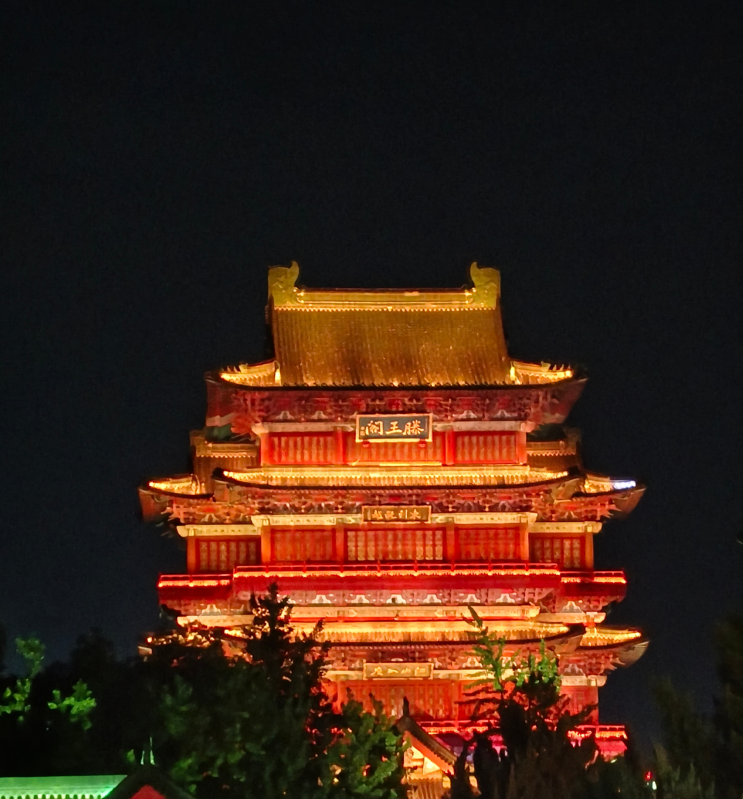
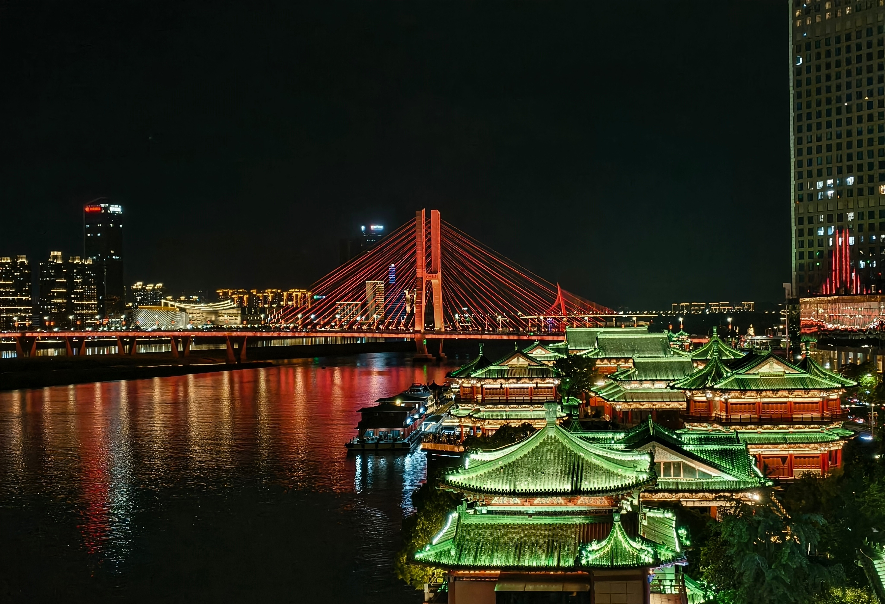
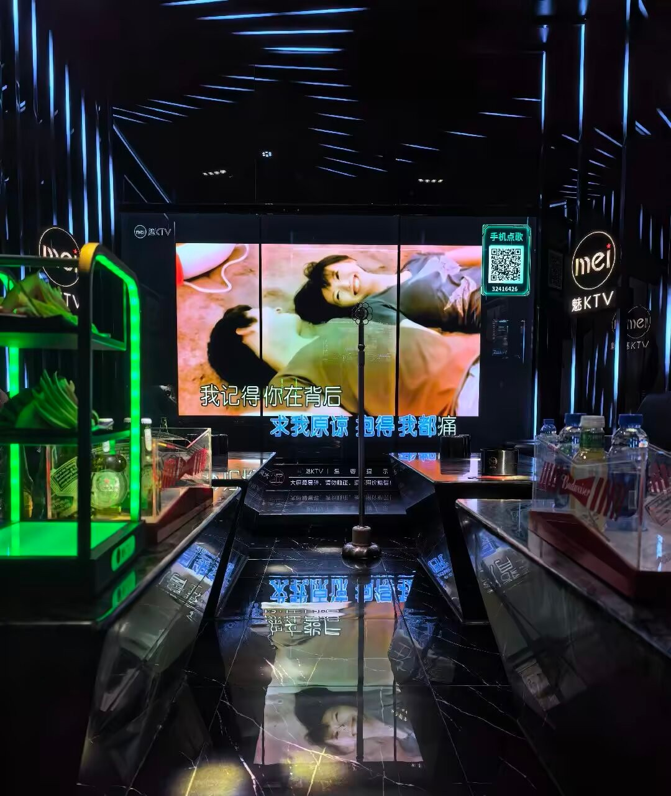
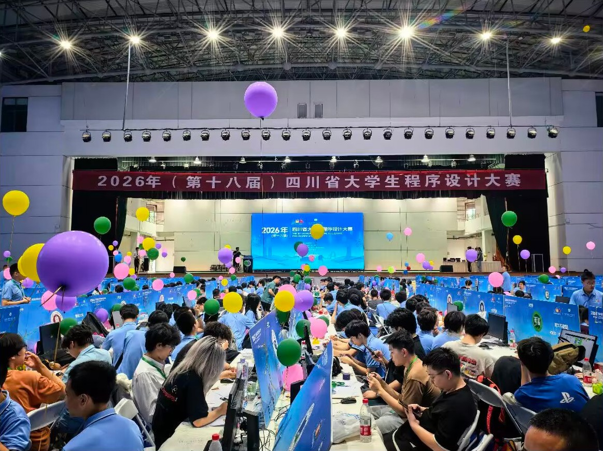
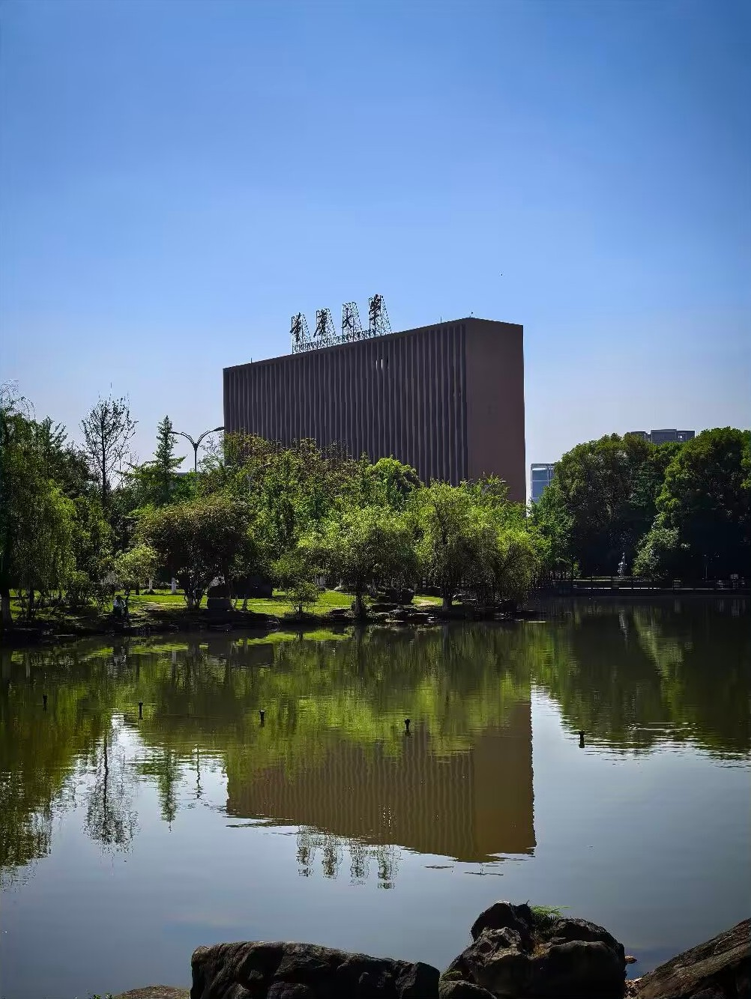
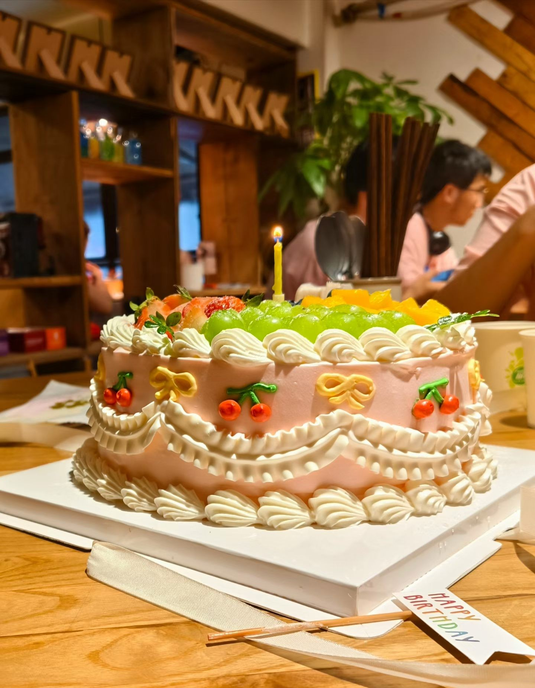

我常常追忆过去。

作为 ACMer，我并没有做过那道 OI 省选的题目，但那道题的背景文字隽美，依然引发我的遐想。

这个学期，我终于成为学校集训队的一员，参加南昌、成都、重庆三场 XCPC 系列赛事。

《滕王阁序》，或许是我选择南昌站的一个原因。豫章故郡，俊采星驰。依稀记得，赛后我们身着比赛服，走在滕王阁前的街上，路旁同样一支神秘三人队朝我们微笑挥手。我虽然不善言辞，也被这种热烈的氛围所感染。

“登临”是诗词创作的重要意象。文人以此为载体，寄托家国情怀与人生哲思。说白了就是键政和发牢骚。我曾经对此嗤之以鼻，不曾想有一日也落入窠臼。滕王阁上，我极目远眺，看着眼前的江岸，遥想古今的变迁。高中的时候，我像嘉豪一样，背这篇不在课标内的诗文，因为它辞藻华丽。那时我肯定没料到，以后会真的站在这里。

成都一行，我更多感受到的，是世界复杂而陌生的一面。之前去过成都，这次就没有去传统意义上的景点。我没有额外请假，只用了周末的时间。

pgh 请大家吃饭，规格很高，价格也相当可观。我邀请了 kw 一起去，但他没有正式参赛，也没有请假的正当理由，于是我们原本约定晚些时候再到。结果自然没有赶上那些饭局，倒是赶上了pgh请客唱K的尾声。

出发那天才发现，kw那节课被取消了。只是时间已经错开，大家也懒得再折腾，便由他请我们吃了顿相对简单的饭。账面上当然不太划算，但也没有谁真的在意这件事。

出租车上，司机就对我邪魅地笑，讲我们住的酒店附近是有名的风月场所。当然我们也洁身自好，没有前去。转头和 kw 一起去了女仆咖啡厅。

我和集训队同专业同学因为比赛耽误了考试，办了缓考。其实我稍早时候已经返校，只是其他同学还在成都玩，我也没有去考试。倒是惹了不少学校那边的麻烦。

重庆市赛那天，恰好是我的生日。kw 准备了生日蛋糕和白葡萄酒，给了我一个惊喜；zzx 送了轻小说，lsq 送了阿米娅山山兔玩偶，ldf 准备的神秘礼物后来揭晓，是史尔特尔景品手办。那晚很开心。只是夜深人静时候，也会想起那些已经走散的人。我不禁又回忆起，高考后十八岁的生日，是和一大帮高中同学一起庆祝，如今几乎都没了联系；十九岁生日，和室友 zx 两人在校门口餐馆吃了顿饭，买了一块小蛋糕。饭桌上觥筹交错时，我也会想：多年以后，在场的朋友们，又有几人还会彼此联系？

一刻也没有留给我们回味省赛邀请赛，立刻到达战场的是暑假多校。我们在多校里打出了把把铁牌的成绩。我平时不认真训练补题，一到比赛就开始挂机。以这样的状态继续留校训练，也没有多少意义。我们决定解散回家了。

在家的日子免不了散漫与消磨，除了零散的训练，我大部分时间在刷视频、玩手游、睡大觉。网络赛在即，是时候收拾散漫，重新捡起备赛的姿态了。
