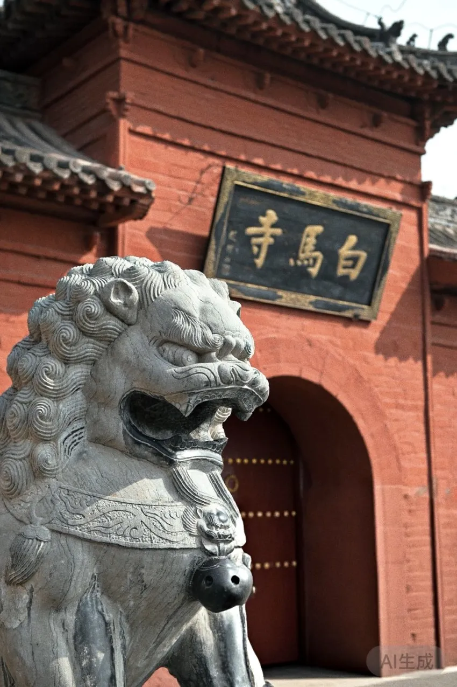

我是河南人，在重庆上学。由于家和学校之间交通不能直达，所以会选择一个城市中转。时间充裕时，就在那里留两天，也算一次出游。

临近开学，这次我选择在洛阳中转返校。我有一位大学同学是洛阳人，原想着旅行结束后可以和他一同返校。出发前，他还帮我挑了酒店、做了攻略；但我到达洛阳后，他却告诉我自己和别的同学有约。

我有点无语，但来都来了，我还是开始了这次旅行。

第一天我参观了龙门石窟。大佛固然震撼，孤独感却藏在细微处：服务员得知双人大床房只有我一人住时的惊讶，身旁熟悉却又不尽相同的方言，邻桌几个人分享一桌菜而我只点了一份主食，以及明明有同学住在这座城市，身边却仍然无人同行。熟悉又陌生，热闹但孤独。在故乡的省份做游客，是一种奇特的感觉。我喝了点啤酒就回到酒店，和其他朋友一起联机打游戏去了。

我在社交媒体上约了一个人第二天同行。取得联系时已经是深夜，我们只简单交换了第二天的出行规划，问了问彼此住处的大致位置。见面之前，我对对方的姓名、性别都一无所知。

我算错了司机接驾所需的时间，只好提前发消息道歉，最后比约定时间晚了几分钟。她身高大约一米六五，短发及颈，戴金属边框眼镜，没有化妆。她没有计较我迟到，我们一同打车去白马寺。

我是那种相对内向、社交能力堪比一根成年香蕉的人。车上，除了各自和司机说了几句话，我俩之间几乎无话。

在游览的过程中稍稍熟络了一些。她原本约好的朋友也临时有事，于是独自玩了两天，后来通过社交媒体上的帖子联系到我。我们一起参观、上香、祈福，互相拍照。我们还尝了景区里的胡辣汤，味道与记忆中的胡辣汤相去甚远。她一勺接一勺地往烩面里加辣椒，每勺都堆得冒尖，看得我心里啧啧称奇。

下一站是复制粘贴的仿古建筑和路边摊。一家店铺的牌匾上写着“某某重庆面条”。她读出“重庆”二字，我也接过话头，说自己在重庆上学。她很惊讶，反复确认后告诉我，她其实是重庆人；先前说自己来自江西，只是因为目前在那里读高三。

我在她的家乡读书，她在我的家乡远游。在这座各自都未能与朋友同行的城市里，我们交换了彼此生活的碎片。她讲起在没有手机的情况下乘飞机旅行的经历，我也讲起了这一年来的出游见闻。

应天门广场上，补光灯照在游客脸上。看着别人做妆造、穿汉服拍照，她轻轻笑了，说自己本来也想尝试，只是因为时间不够错过了。

站在城门上，看着热闹的灯影，我意识到：走出这片古城，我们便会回到各自的轨道。她将回江西赶考，我也会返回重庆求学。以后会怀念的，并不一定是具体的那个人，也可能是这种无负担的同频。

分别时，我们只是互道了拜拜，没有约定以后再见。返校以后，望着满街的火锅店，我会不会想起那碗加了好多勺辣椒的烩面？
