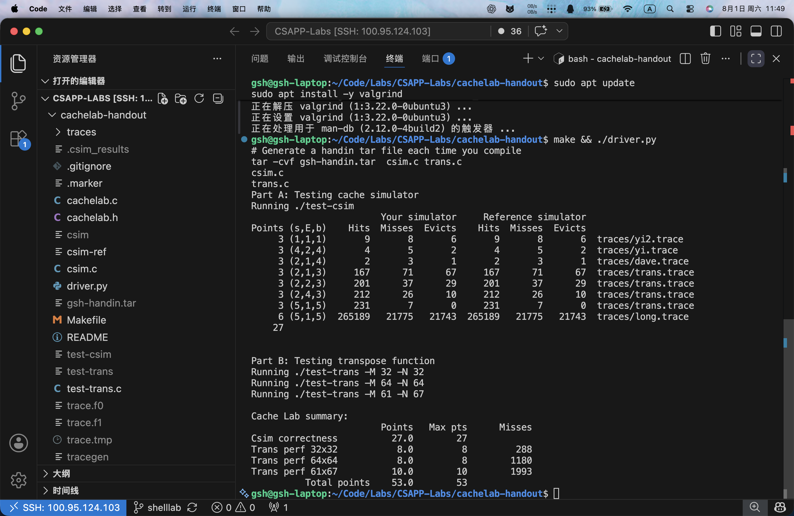

## 实验概览

早就听闻Cache对于数据读写至关重要。以前写 ST 表时，我就注意过数组维度和遍历顺序会影响缓存命中率。完成Cache Lab之后又有新的收获。

Cache Lab 分为两个部分：

- Part A：使用 C 语言编写一个缓存模拟器，模拟缓存内存处理访存请求时的行为。
- Part B：优化一个小型矩阵转置函数，尽可能减少转置过程中的缓存未命中次数。

两部分均已完成。



相关链接：

- [Cache Lab 实验讲义](https://csapp.cs.cmu.edu/3e/cachelab.pdf)
- [我的完整实现](https://github.com/shannonkwan86/CSAPP-Labs/tree/main/cachelab-handout)
- [参考文章：CSAPP | Lab5-Cache Lab 深入解析](https://zhuanlan.zhihu.com/p/484657229)

## Part A：缓存模拟器

### 任务要求

缓存模拟器根据命令行参数构造缓存，读取 trace 文件中的访存记录，最后输出 `hits`、`misses` 和 `evictions`：

```bash
./csim -s 4 -E 1 -b 4 -t traces/yi.trace
```

参数含义如下：

| 参数 | 含义 |
| --- | --- |
| `-s 4` | 组索引位数为 4，缓存共有 16 个组 |
| `-E 1` | 每个组包含 1 条缓存行，因此是直接映射缓存 |
| `-b 4` | 块偏移位数为 4，每个缓存块大小为 16 字节 |
| `-t traces/yi.trace` | 要读取的访存轨迹文件 |

### 缓存的组织方式

缓存共有 $S = 2^s$ 个组，每组有 $E$ 条缓存行。CPU 发出的地址则被解释为标记、组索引和块偏移三部分：

从高位到低位：

| `tag` 标记 | `set` 组索引 | `offset` 块偏移 |
| --- | --- | --- |
| $t$ 位 | $s$ 位 | $b$ 位 |

组索引定位唯一的缓存组，随后只需遍历其中的 $E$ 行并比较 `tag`。块偏移用于选择块内字节；$E$ 不参与地址切分。

### 数据结构设计

真实缓存行包含有效位、`tag` 和 $B = 2^b$ 字节的数据块。不过本实验只统计缓存行为，不需要保存或返回真实数据，因此我的 `Line` 只保留：

```c
typedef struct
{
    int valid;
    unsigned long long tag;
    int lru;
} Line;
```

`valid` 判断缓存行是否有效，`tag` 标识其中的内存块，`lru` 记录最近访问时间。

### 地址解析

移掉最低的 $s + b$ 位即可取得 `tag`；移掉 $b$ 位后，再用低 $s$ 位全为 1 的掩码截取组索引：

```c
unsigned long long tagAddr = addr >> (b + s);
unsigned long long setIndex = (addr >> b) & ((1ULL << s) - 1);
```

本实验不读取缓存块中的真实字节，所以模拟器只需要计算 `tagAddr` 和 `setIndex`，不需要保存缓存块中的实际数据，也不需要计算块内偏移。

### 一次缓存访问

根据 `setIndex` 定位缓存组，再遍历组内的 $E$ 条缓存行：

1. **命中**：找到 `valid == 1` 且 `tag` 相同的缓存行，增加 `hits` 并更新它的访问时间；
2. **未命中但有空行**：增加 `misses`，将数据装入第一个无效行；
3. **未命中且没有空行**：增加 `misses` 和 `evictions`，替换最久未使用的缓存行。

### LRU 替换策略

我用一个全局递增的 `time` 作为时间戳。每次访问缓存时令 `time++`，命中或装入一行时记录 `line.lru = time`；发生替换时，选择 `lru` 最小的缓存行。

曾经听过一种 $O(1)$ 的 LRU 实现：用哈希表定位缓存项，用双向链表维护访问顺序。访问时将节点移动到链表头，淘汰时直接删除链表尾。我的实现需要遍历组内的 $E$ 条缓存行，替换复杂度为 $O(E)$；由于本实验中的 $E$ 很小，使用时间戳更简单直接。~~一定不是自己比较懒还没有学习这种方法的实现。~~

### 读取并执行访存轨迹

逐行读取操作类型、地址和访问大小。`I` 是取指操作，直接忽略；`L` 和 `S` 各访问一次缓存；`M` 表示先读后写同一地址，因此连续访问两次。

### Part A 调试与结果

运行完整测试后，缓存模拟器通过了全部测试，正确性得分为 27/27。

## Part B：优化矩阵转置

### 任务要求

Part B 要求在一个 1 KiB 的直接映射缓存上优化矩阵转置。该缓存包含 32 个组，每组 1 条缓存行，每个缓存块为 32 字节，即 $s = 5$、$E = 1$、$b = 5$。

转置函数必须保持 $A$ 不变，不能使用辅助数组、动态内存或递归，并且每个函数最多只能使用 12 个 `int` 类型的局部变量。在保证结果正确的基础上，分别测试以下三种矩阵规模：

| 矩阵规模 | 满分要求 |
| --- | --- |
| 32 × 32 | miss 数少于 300 |
| 64 × 64 | miss 数少于 1300 |
| 61 × 67 | miss 数少于 2000 |

### 为什么朴素转置会产生大量 miss

朴素转置并不是读取 $A$ 时表现不好：按行读取 $A$ 能充分利用一个缓存块中的连续元素。真正的问题在于写入 `B[j][i]` 时形成了按列访问，相邻写入地址相距一整行，导致刚载入的缓存块无法被充分复用。

此外，实验使用的是**直接映射缓存**，$A$ 与 $B$ 的缓存块还可能映射到同一组并相互驱逐，尤其容易发生在对角块中，因此产生了大量 miss。

### 分块的基本思路

分块的目标是把一次完整的矩阵转置，拆成多个较小的子矩阵分别处理。处理一个小块时，$A$ 中相邻的数据可以在缓存中重复利用，减少按列写入 $B$ 带来的 miss。

实验使用的缓存块大小为 32 字节，一个 int 占 4 字节，因此一行连续的 8 个 int 正好对应一个缓存块。对于 32 × 32 矩阵，选择 8 × 8 作为分块大小：每个小块的一行读取可以完整利用一个缓存块，而矩阵的每条边可以分成 $32 / 8 = 4$ 个小块。

分块本身只能改善**空间局部性**；在直接映射缓存中，还需要额外处理 $A$ 和 $B$ 的映射冲突，尤其是对角线位置的冲突。

### 32 × 32 矩阵

对于 32 × 32 矩阵，我使用 8 × 8 分块。外层循环每次移动 8 行、8 列，处理一个子矩阵时，先读取 $A$ 当前行的 8 个元素，再写入 $B$ 中对应的 8 个位置：

当前行的 8 个 $A$ 元素连续排列，正好占一个缓存块。写入 $B$ 时，虽然一次会访问 8 个不同的行，但对于固定的 $B$ 行，随着 `i` 增加，访问的是连续的 8 个元素，因此也能复用同一个缓存块。

在 32 × 32 的情况下，这 8 个 $B$ 缓存块彼此映射到不同的缓存组，不会因为直接映射而互相驱逐。真正需要处理的是 $A$ 和 $B$ 之间的组映射冲突。

在**对角分块**中，$A$ 和 $B$ 可能映射到相同的缓存组。为避免写入 $B$ 后再次读取 $A$，代码先将 $A$ 当前行的 8 个值保存到 `tmp0` 到 `tmp7`，再统一写入 $B$，从而减少冲突带来的额外 miss。

最终 32 × 32 的 miss 数为 288，获得了该项的 8/8。

### 64 × 64 矩阵

64 × 64 的难点在于，直接沿用 8 × 8 的转置会产生严重的组冲突。此时矩阵一行有 64 个 `int`，相邻两行的地址相差 256 字节，也就是 8 个缓存块。因此访问同一列的 8 行时，缓存组索引会重复：

```text
set, set+8, set+16, set+24,
set, set+8, set+16, set+24
```

组索引会按 `set、set+8、set+16、set+24` 循环，后 4 个块重新映射到前 4 个块使用的组。因此，8 个不同的 $B$ 块只映射到 4 个缓存组，在 $E=1$ 的直接映射缓存中会互相驱逐。

因此代码仍以 8 × 8 为大块，将其划分为四个 4 × 4 象限，并分三个阶段处理：

1. **处理上面 4 行**：每次读取 $A$ 的连续 8 个元素。前 4 个直接写入最终的左上区域，后 4 个暂时放在 $B$ 的右上区域；
2. **处理下面 4 行并交换**：读取 $A$ 左下区域的数据，同时取出 $B$ 中暂存的右上数据。前者写入最终的右上区域，后者搬到最终的左下区域；
3. **处理右下区域**：将 $A$ 右下的 4 × 4 部分写入 $B$ 的右下区域。

每个阶段只访问 $B$ 的 4 行，避免了 8 个 $B$ 块之间的重复组映射；暂存操作则改变了写入顺序，避免数据直接写入最终位置时产生额外冲突。`tmp0` 到 `tmp7` 用来保存已经读出的 $A$ 数据，避免它们被 $B$ 的写入驱逐后再次读取。

最终 64 × 64 的 miss 数为 1180，获得了该项的 8/8。

### 61 × 67 矩阵

对于 61 × 67 矩阵，代码直接使用 16 × 16 分块。矩阵的列数和行数都不是 16 的整数倍，因此需要在边界处截断：列方向分为 `16 + 16 + 16 + 13`，行方向分为 `16 + 16 + 16 + 16 + 3`。

每个分块处理时，先计算本块实际的结束位置；如果分块越过矩阵边界，就将结束位置限制在 `M` 或 `N` 以内。随后仍按行读取 $A$，并将元素写入转置位置 $B[j][i]$。与 64 × 64 不同，这里没有额外的暂存和交换步骤，普通的分块遍历就能达到要求。

最终 61 × 67 的 miss 数为 1993，获得了该项的 10/10。

### Part B 调试与结果

运行完整测试后，三个矩阵规模的转置函数均通过测试：32 × 32 获得 8/8，64 × 64 获得 8/8，61 × 67 获得 10/10。最终总分为 **53/53**。


## 总结

Part A 让我理解了地址拆分、缓存组、缓存行与缓存块之间的关系。

Part B 中三个转置函数的时间复杂度均为 $O(MN)$，但不同的访存顺序会显著改变空间局部性和冲突未命中次数，这也是相同复杂度的实现出现明显性能差异的原因。
